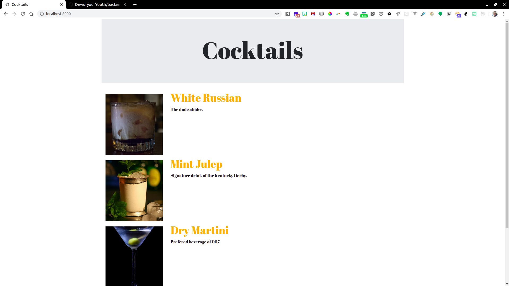
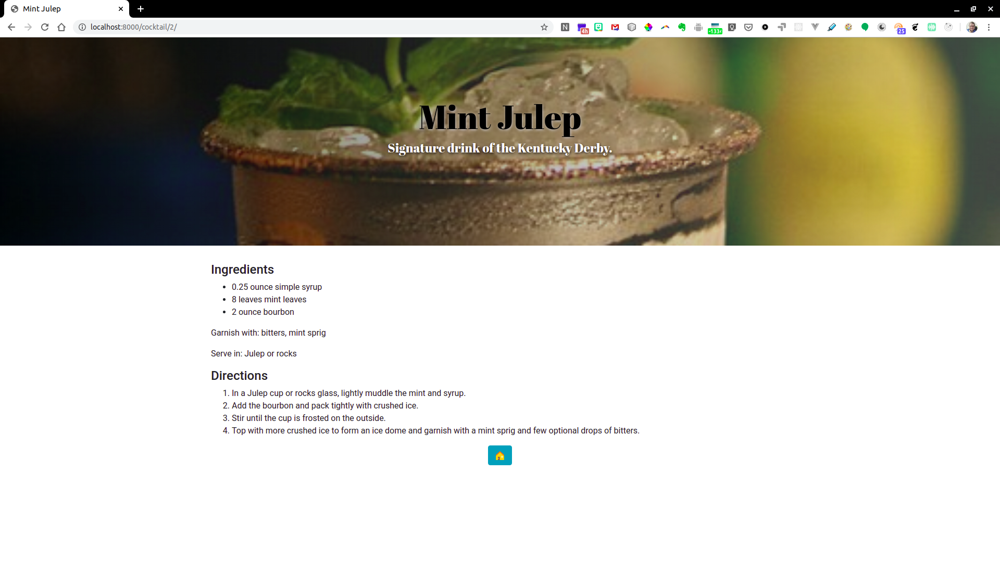

# Cocktail App

## This is an app for keeping track of cocktail recipes

### Done

- ☑️ Basic structs for cocktail recipes
- ☑️ GORM integration
- ☑️ API endpoint handlers for adding and listing cocktail recipes
- ☑️ Basic working HTML templates for displaying the list of cocktails, as well as individual detailed recipes
- ☑️ SQLite3 database
- ☑️ Serve static files
- ☑️ images and basic css styling for templates

### To Do

- 🔲 EDIT endpoint handler
- 🔲 DELETE endpoint handler
- 🔲 JavaScript frontend
- 🔲 Add cocktail GUI
- 🔲 Users and auth
- 🔲 Add user field to cocktail
- 🔲 GUI for image upload
- 🔲 Nice styling
- 🔲 Postcard export and share on Instagram & Twitter etc.

Previews

